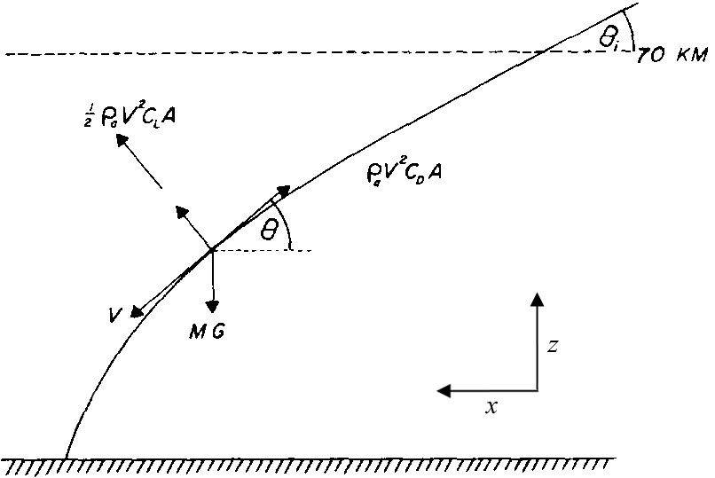
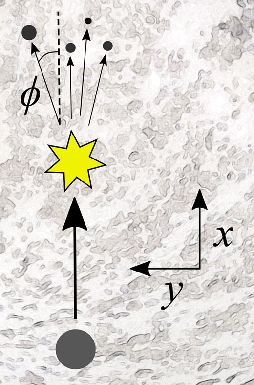
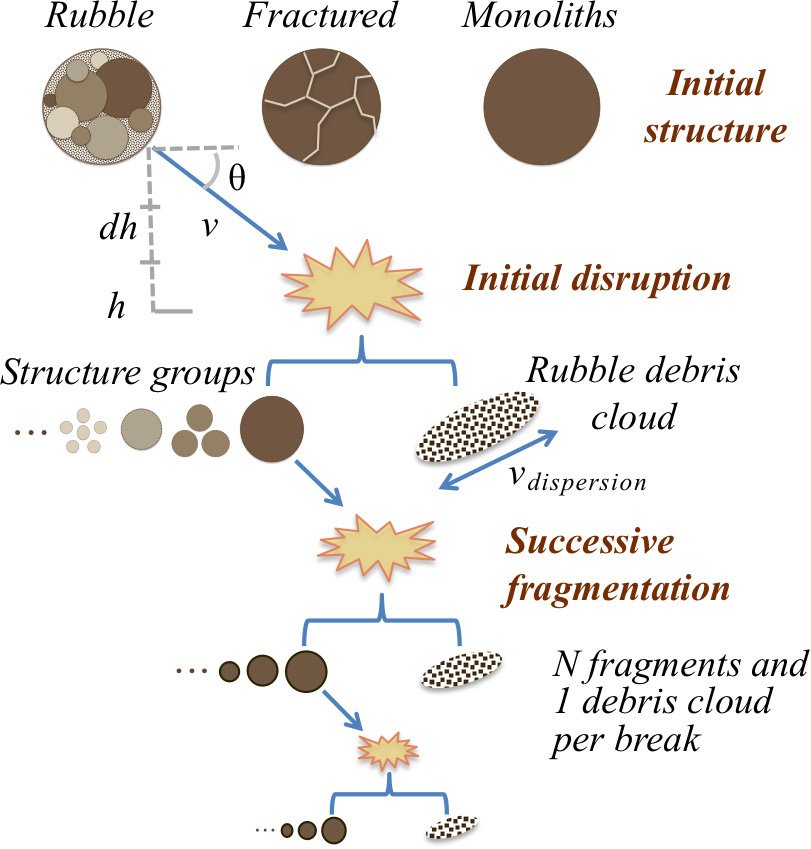
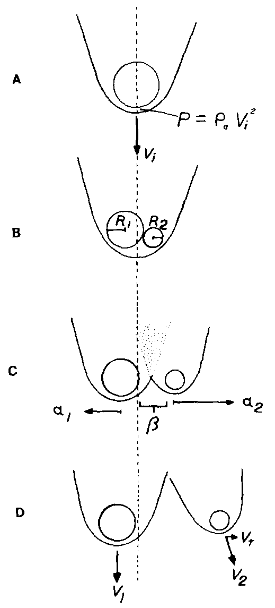
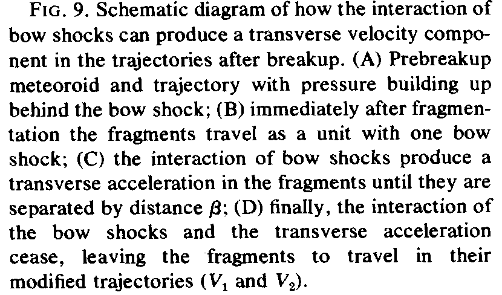
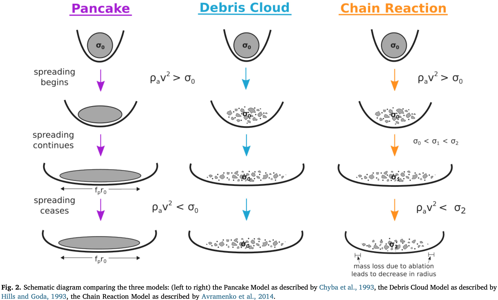
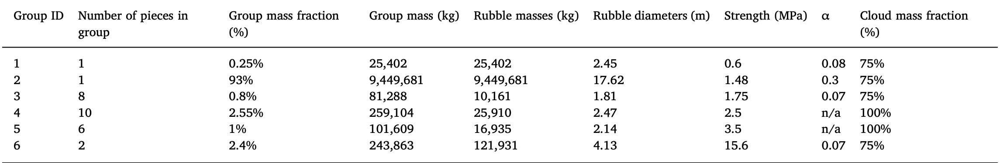

# Fragment-Cloud Model

## Overview

Implementation of the fragment-cloud model (FCM) for meteoroid atmospheric entry modeling.
The theoretical model is described in detail in Wheeler et al. (2018) [DOI:10.1016/j.icarus.2018.06.014](https://doi.org/10.1016/j.icarus.2018.06.014)

We implemented the model as a C++ extension for Python and added a number of capabilities:

* Computing the location of impact craters.
* Calculating the size of impact craters with scaling laws by Holsapple (1987) [DOI:10.1016/0734-743X(87)90051-0](https://doi.org/10.1016/0734-743X(87)90051-0).
* Calculating several characteristics of impact crater clusters, such as effective diameter, dispersion, aspect ratio (established in Daubar et al. (2019) [DOI:10.1029/2018JE005857](https://doi.org/10.1029/2018JE005857)).
* Restricting the model to the separate fragments model (Passey and Melosh (1980) [DOI:10.1016/0019-1035(80)90072-X](https://doi.org/10.1016/0019-1035(80)90072-X) or one of the "pancake-type" models.
* Choosing between all major "pancake-type" models: Chyba et al. (1993) [DOI:10.1038/361040a0](https://doi.org/10.1038/361040a0), Hills and Goda (1993) [DOI:10.1086/116499](https://doi.org/10.1086/116499), and Avramenko et al. (2014) [DOI:10.1002/2013JD021028](https://doi.org/10.1002/2013JD021028).
* Options for introducing additional randomness into the break up events (see Model section below)
* Using either the spherical or the flat planet approximation.
* Built-in utility to retrieve air density values from the Mars Climate Database Web Interface [http://www-mars.lmd.jussieu.fr/mcd_python/](http://www-mars.lmd.jussieu.fr/mcd_python/)

## Installation

### Prerequisites

You need to have the following packages installed:

* `python3` v. 3.7 or later with `numpy` and the python development headers
* `C++17` compiler, e.g. `g++` or `clang`
* `cmake` v. 3.12 or later
* `boost` v. 1.70 or later, including the `python3`, `numpy`, and `unit_test_framework` components.

### Instructions

1. Open command line and navigate to the `fragment-cloud/` folder.
2. Inside the `fragment-cloud/` folder, create a new folder called `debug/` or `release/` and `cd` into it.
3. Run the following command: `cmake ..` This will check all dependencies and create a file called `setup.py` inside the `fragment-cloud/` folder.
4. Navigate to the `fragment-cloud/` folder.

For the final step, there are a few different options:

* Install the `fcm` software like a pip package: `python3 setup.py install`. Then the `fcm` package will be available in your default python path.
* Only compile the C++ component: `python3 setup.py build_ext --inplace`. Then you have to add the `fragment-cloud` folder to `sys.path` in order to import the `fcm` module in python, or run scripts from within the `fragment-cloud` folder.
* Build the `fcm` package in a separate build folder: `python3 setup.py build`. This will create a `build/` folder and place all package files in there.

## Tests

1. Navigate to an empty folder called `debug/` or `release/` inside the `fragment-cloud/` folder.
2. Run `cmake -DCMAKE_BUILD_TYPE=Debug -DBUILD_TESTS=1 ..` This will instruct the compiler to use debug flags, which makes it possible to run them with a debugger.
3. `cmake --build .`
4. `ctest`

## Example usage

```python3
import fcm
import fcm.atmosphere as atm

# Load atmospheric density vs. elevation data
atmosphere = atm.US_standard_atmosphere()

# Default parameters
parameters = fcm.FCMparameters(g0=9.81, Rp=6371, atmospheric_density=atmosphere)

# Define a meteoroid
impactor = fcm.FragmentationMeteoroid(velocity=15, angle=45, density=3000, radius=1, strength=1e4)

# Simulate impact
results = fcm.simulate_impact(parameters, impactor, h_start=100)

# Visualise results
import matplotlib.pyplot as plt
from fcm import crater_tools

## 1. dE/dz
plt.plot(results.energy_deposition.to_numpy(), results.energy_deposition.index)
plt.xscale('log')
plt.xlabel('dE/dz (kt TNT/km)')
plt.ylabel('z (km)')
plt.show()

## 2. Crater cluster
crater_tools.plot_craters(results.craters)
plt.show()
```

## The Model

A meteoroid is modeled as a homogenous sphere, deescribed by the following parameters:
mass $m$, velocity $v$, radius $r$, strength $\sigma$. If the Wheeler et al. (2018) model is used,
the meteoroid also has an inner structure as described in the paper, which only has an impact during break up.
Before and after, it is still modeled as a homogeneous sphere.

When the meteoroid enters the planetary atmosphere at a given initial height,
there are 3 distinct processes that are modeled: atmospheric descent, meteoroid break up, and impact crater formation.

### Atmospheric Descent

Atmospheric descent is modeled with the standard meteoroid physics equations.
They describe how the forces of drag, lift and gravity act on the meteoroid.
In addition, the meteoroid ablates due to the heat of atmospheric entry,
and there are some correction terms that account for the planet's curvature.

The following figures shows these forces and the coordinates that the model uses:

Lateral view (from Passey and Melosh, 1980) | Bird's eye view
:--: | :--:
 | 

$x$ is the downrange distance from the point of atmospheric entry, projected onto the planetary surface.
$z$ is the height above standard 0, and $y$ expresses the deviation from the original straight downrange path after meteoroid break up.
$\theta$ is the angle relative to the horizon at the current position $x$ and $y$ on the surface. $\phi$ is the trajectory angle projected on the $xy$-plane.

Using these coordinates, the meteoroid physics equations are:

* $\frac{dv}{dt} = -\frac{C_D \rho_a v^2 \pi r^2}{2m} + g\sin(\theta)$
* $\frac{dm}{dt} = -\frac{C_\mathrm{ab}}{2}\rho_a v^3 \pi r^2$
* $\frac{d\theta}{dt} = \frac{g\cos(\theta)}{v} - \frac{C_L \rho_a \pi r^2 v}{2m} - \frac{v\cos(\theta)}{R_p + z}$
* $\frac{dz}{dt} = -v\sin(\theta)$
* $\frac{dx}{dt} = v\cos(\theta)\cos(\phi)\frac{R_p}{R_p + z}$
* $\frac{dy}{dt} = v\cos(\theta)\sin(\phi)\frac{R_p}{R_p + z}$
* $\frac{d\phi}{dt} = 0$

$\rho_a$ is the air density, $g$ the gravitational accelecation, $C_D$, $C_\mathrm{ab}$, $C_L$ are the coefficients of drag, ablation and lift respectively. $R_p$ is the planet's radius.

### Break Up

When the ram pressure $(\rho_a \cdot v^2)$ exceeds the meteoroid's strength, it breaks up into pieces.
There are multiple ways to model the break up process.
This library provides the three major ones, the separate fragments approach, the debris cloud approach, and the fragment-cloud approach, which is a combination of the two.
The following figure from Wheeler et al. (2018) summarizes them:



#### Separate fragments model

(Only the left side in the diagram) On break up, the meteoroid splits into a small number of fragments (some may be smaller, some larger), which then descend further into the atmosphere under separate bow shocks.

The following illustration from Passey and Melosh (1980) shows how exactly it works:

schematic | description
:--: | :--:
 | 

The transverse velocity is calculated like
$V_T = V_i\sqrt{\frac{3}{2}C\frac{R_2}{R_1}\frac{\rho_a}{\rho_f}}$
($\rho_f$ is the meteoroid density) and added perpendicularly to $V_i$ to both new fragments, while preserving momentum. The direction in the plane perpendicular to $V_i$ is chosen randomly. $C$ is a constant; $C\sim 1$, $C \in [0.02, 1.52]$ (Passey and Melosh, 1980), $\frac{3}{2}C\approx 0.19$ (Artemieva and Shuvalov (2001) [DOI:10.1029/2000JE001264](https://doi.org/10.1029/2000JE001264)).

The mass ratio of the new fragments (and therefore $R_1$ and $R_2$ are set by the user as an input. Further, a random range can be specified, e.g. (50/50 to 80/20).

Finally, a new strength is calculated for the two fragments. Following the suggestion in Artemieva and Shuvalov (2001), we scale the strength like $\sigma_f = \sigma_b \left(\frac{R_b}{R_f}\right)^\alpha \cdot 10^x$, where $x$ is a chosen from a random normal distribution around 0, with a user-defined standard deviation (default 0). $\alpha > 0$ is a constant, defined by the user. This relationship increases strength for smaller fragments, while also providing some randomness.

The simulation stops once the fragment would produce a crater that is too small to be detected.

#### Debris cloud model

(Only the right side of the diagram) The meteoroid splits into thousands of fragments which all continue descending under a common bow shock, and can therefore be simulated as a common entity, describing a cloud of small debris pieces that expands and ablates. The model provides three cloud models of this class:



The image is from McMullan and Collins (2019) [DOI:10.1016/j.icarus.2019.02.013](https://doi.org/10.1016/j.icarus.2019.02.013).

The simulation stops once the debris cloud has lost 99.99% of its original kinetic energy.

#### Fragment-cloud

Both things happen: A few large pieces separate and form individual bow shocks, the rest is described with a debris cloud model.

Furthermore, the meteoroid can be modeled as a rubble pile with an inner structure. On the first break up, these components of the inner structure, called structure groups, separate and descend under separate bow shocks.

Example of inner structure definition from Wheeler et al. (2018):



### Impact crater formation

